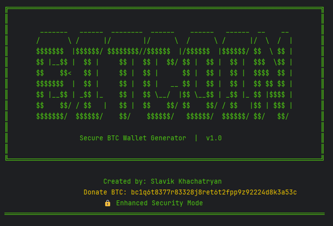
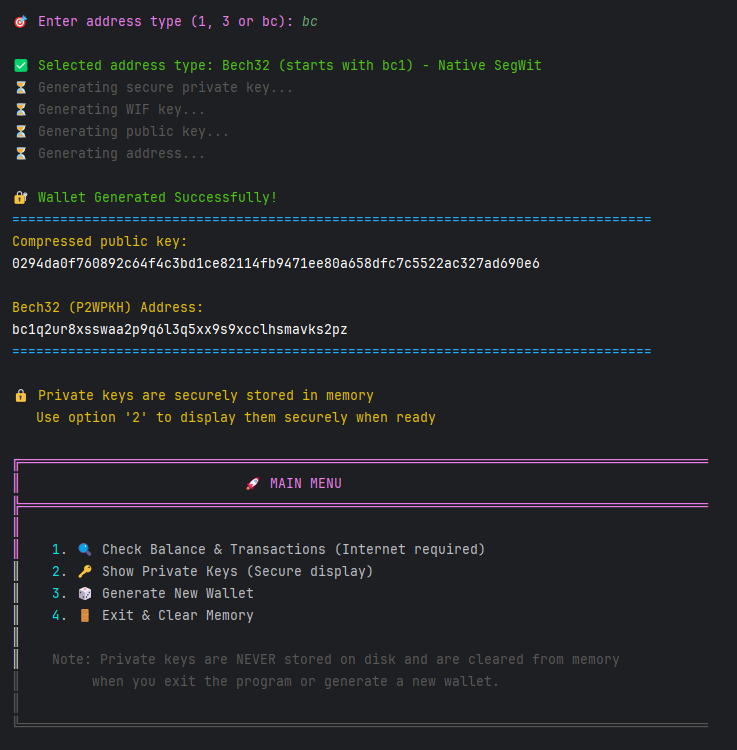

# Secure BTC Wallet Generator v1.0



A secure and offline Bitcoin wallet generator written in Python.  
Generates private keys, WIF, public keys, and Bitcoin addresses (Legacy, SegWit Compatible, Bech32).  

## Features

- Generates Bitcoin wallets offline
- Supports P2PKH (Legacy), P2SH-P2WPKH (SegWit Compatible), and Bech32 (Native SegWit) addresses
- Secure memory cleanup of private keys
- Checks balance and transactions using blockchain.com API
- User-friendly terminal interface with banners and menus

## Security Warnings

⚠️ Never use this wallet for large amounts.  
⚠️ Generate wallets on offline computers only.  
⚠️ Private keys are stored only in RAM and cleared after use.  
⚠️ Make secure backups (paper or hardware).  
⚠️ Assume this computer may be compromised.  

For large amounts, consider:
- Hardware wallets (Ledger, Trezor)
- Multisig wallets
- Professional custody solutions



## Installation

1. Clone this repository:
```bash
git clone https://github.com/yourusername/secure-btc-wallet.git
```

2. Navigate to the folder:
```bash
cd secure-btc-wallet
```

3. Install dependencies:
```bash
pip install -r requirements.txt
```

## Usage

Run the wallet generator:
```bash
python wallet_generator.py
```

Follow the menu prompts to generate wallets, display private keys securely, and check balances.

## Dependencies

- `secrets`
- `hashlib`
- `base58`
- `ecdsa`
- `requests`

## Author

Created by **Slavik Khachatryan**  
Donate BTC: `bc1q6t8377r83328j8ret6t2fpp9z92224d8k3a53c`

## License

This project is licensed under the MIT License. See [LICENSE](LICENSE) for details.

